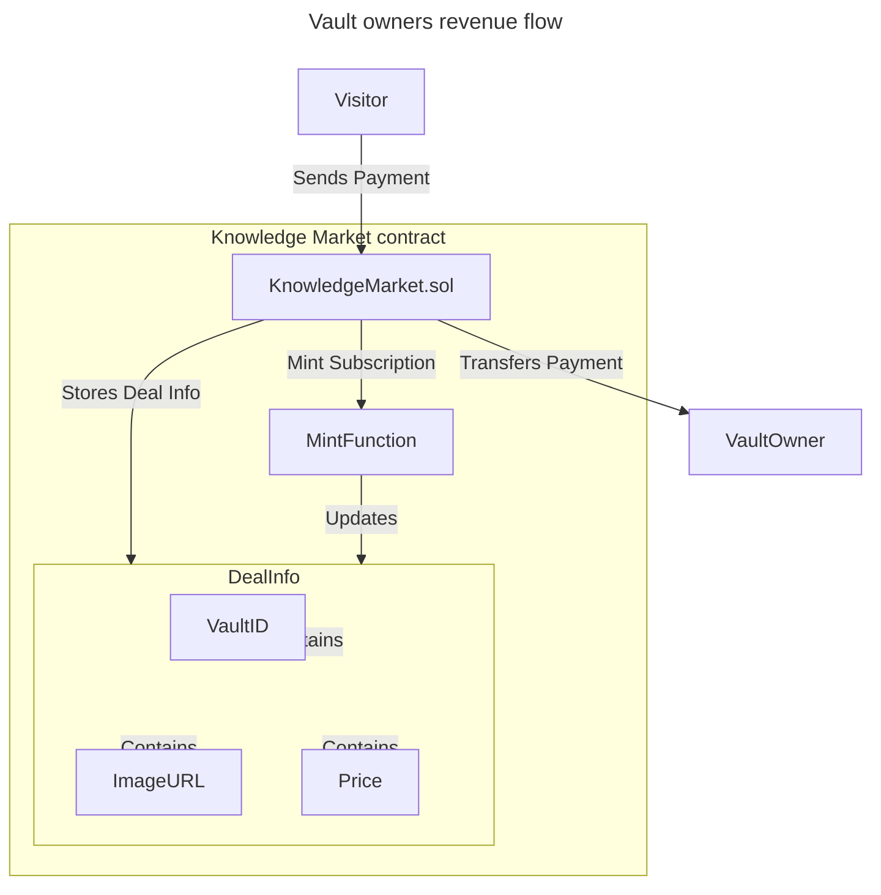
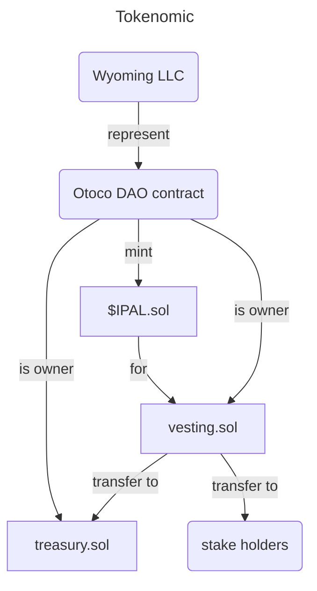
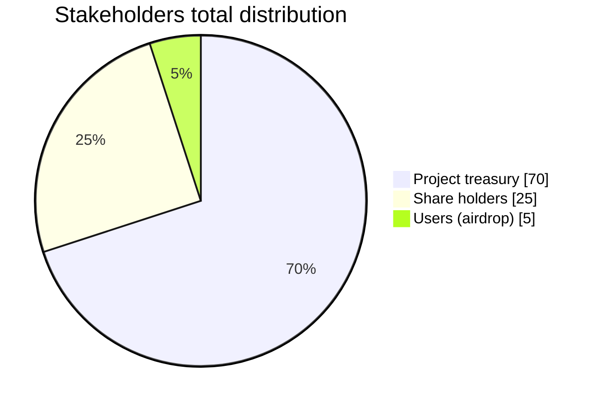

# White paper (draft)

## NFT gated access

The `DealInfo` data structure in our system plays a critical role in enhancing both asset liquidity and the immutability of digital art or images. By storing key details like `VaultID`, `ImageURL`, and `Price` on the blockchain, we ensure that each deal's specifics are transparent and verifiable by any party at any time. This on-chain storage of deal information significantly boosts asset liquidity, as investors and users can easily assess the value and authenticity of an asset without needing intermediaries. Furthermore, the immutability of blockchain technology guarantees that once an image or piece of art is associated with a `DealInfo` entry, its link to the asset cannot be altered, providing a permanent record of ownership and authenticity. This feature not only protects creators by securing their work against unauthorized modifications but also instills confidence in buyers, fostering a more trustful and vibrant marketplace for digital assets.

## $IPAL token

